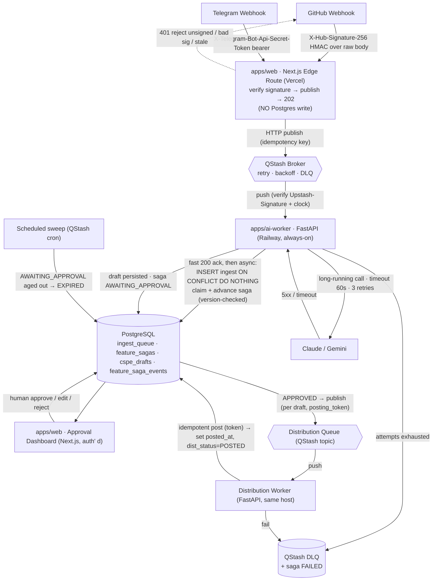

# Autonomous Founder Identity Engine — Polyglot Architecture Blueprint

> **Scope of this pass:** DESIGN + Sprint-1 scaffold only. No service implementation, no application code.
> **Mode:** Blueprint skill, direct mode (working dir is not a git repo — branch/PR workflow degrades to edit-in-place).
> **Persona continuity:** the synthesis stage emits drafts under persona `mehedi-boss-alpha` (see `alpha_blueprint.md`).
> **Status:** revised after architecture / database / security review. All CRITICAL + HIGH findings folded in; see §8 ledger.

---

## 0. Decisions (Open Questions Resolved)

| Decision | Choice | One-line rationale |
|---|---|---|
| **Broker** | **Upstash QStash** as the **sole durable trigger** (transport + retry/backoff/DLQ); **PostgreSQL is the saga + draft system of record, written only by the worker** | Serverless-edge producer can't safely hold TCP pools; QStash is HTTP-publish + push-delivery with retries/DLQ built in. Edge does **not** write Postgres (see §0.1). |
| **Always-on worker host** | **Railway** (primary) · Fly.io (alternative) | Simplest always-on host with colocated managed Postgres; Fly.io if multi-region/scale-to-machine is later required. **Never Vercel edge** (LLM calls are long-running; edge has hard duration/concurrency caps). |
| **Why not Postgres `SKIP LOCKED` as the broker** | Rejected as *primary transport* | Forces the Vercel edge to hold a Postgres connection per webhook → pool pressure under burst. Tops out ~100–200 jobs/s before lock contention. Documented fallback only. |
| **Why not bare Upstash Redis** | Rejected as *primary transport* | You'd hand-build retry/backoff/DLQ and still need an always-on consumer. QStash gives those over HTTP for free. |

### 0.1 The edge is publish-only (resolves the dual-write hazard)
The edge performs exactly: **verify signature → publish to QStash → return 202.** It does **not** write to Postgres. A single network side effect means there is no non-atomic dual-write and therefore no "row inserted but message never published" (or vice-versa) dropped-message path. QStash is the *only* durable trigger; the worker performs the idempotent `INSERT … ON CONFLICT DO NOTHING` into `ingest_queue` on first consume. This also keeps the edge connection-pool-free, making the §0 rejection of `SKIP LOCKED` internally consistent.

**Research basis (search-first):** QStash is the default for serverless background jobs under ~1M/day — HTTP publish, retries/scheduling/DLQ built in, no persistent TCP (which breaks in serverless). Postgres-as-queue is excellent *when you already run Postgres* but tops out ~100–200 jobs/s. FastAPI workers must treat delivery as at-least-once and make tasks idempotent via an idempotency key.

Sources:
- [QStash: Messaging for the Serverless — Upstash](https://upstash.com/blog/qstash-announcement)
- [Upstash QStash: Serverless Background Jobs — DEV](https://dev.to/whoffagents/upstash-qstash-serverless-background-jobs-without-the-infrastructure-pain-ic8)
- [Using FOR UPDATE SKIP LOCKED For Queue Workflows — Netdata](https://www.netdata.cloud/academy/update-skip-locked/)
- [Potential Consequences of Using Postgres as a Job Queue](https://richyen.com/postgres/2026/05/04/postgres_job_queue.html)
- [Building Resilient Task Queues in FastAPI with ARQ Retries](https://davidmuraya.com/blog/fastapi-arq-retries/)
- [FastAPI + Celery: Idempotent Tasks and Retries — Medium](https://medium.com/@hjparmar1944/fastapi-celery-work-queues-idempotent-tasks-and-retries-that-dont-duplicate-d05e820c904b)

---

## 1. Latency & Resilience Justification (queueing, not Big-O)

We compare the **decoupled async** pipeline against a hypothetical **Next.js serverless monolith** that verifies the webhook and then blocks the same invocation until the LLM returns. The work here is **I/O-bound network latency to an LLM**, so Big-O/asymptotic complexity does not model wall-clock behavior — queueing theory and p99 SLOs do.

Let:
- `S` = mean LLM synthesis service time ≈ **5–20 s** (long-running Claude/Gemini call).
- `λ` = webhook arrival rate (bursty); `λ̄` = its mean.
- `c` = async in-flight concurrency on the always-on worker (LLM calls are I/O-bound, so one host holds many in flight cheaply).
- `μ` = sustained drain rate ≈ **`min(c / S, R_provider)`**, where `R_provider` is the Claude/Gemini account rate limit. **The true binding constraint is usually `R_provider`, not `c`** — size against whichever is smaller.
- `ρ` = `λ̄ / μ` (utilization). Stability requires `ρ < 1`; target **`ρ ≤ 0.7`** for burst headroom.

### 1.1 Request acknowledgement latency
- **Monolith:** the sender waits the full `S`. GitHub's delivery timeout is ~10 s, so a 5–20 s call **breaches the webhook timeout** → GitHub marks delivery failed and redelivers → duplicate work. p99 ack ≈ `S`.
- **Decoupled:** the edge does HMAC verify (sub-ms) + one HTTPS `POST` to QStash (~10–40 ms regional), then returns **HTTP 202**. No DB write on the hot path. **Target ack p99 < 100 ms**, fully decoupled from `S`.

### 1.2 Throughput under burst (queue smoothing vs serverless wall)
- **Monolith (Little's Law):** concurrent invocations `L = λ · S`. A burst of even 10 webhooks at `S = 15 s` demands ~150 concurrent long-lived functions, colliding with Vercel **per-account concurrency limits** and **function max-duration** caps → `429`s, cold starts, dropped webhooks. A **hard wall**.
- **Decoupled:** the edge ack is cheap; the burst is absorbed as **queue depth** in QStash and drained at `μ`. While `λ̄ < μ`, backlog is bounded.
  - **Model honesty:** the worker is multi-server (concurrency `c`), so the exact model is **M/M/c (Erlang-C)**. We use the simpler **M/M/1 wait `Wq ≈ ρ/(μ−λ̄)` as a deliberate conservative upper bound** — Erlang-C wait is lower for the same `ρ`, so sizing to the M/M/1 bound is safe.
  - **Burst transient (not just steady state):** Little's Law governs the steady-state mean; a large burst can still spike *transient* depth. Worst-case transient backlog ≈ `(peak_burst_count − μ·burst_window) ` items, draining in ≈ `backlog/μ`. **This must stay within QStash's max retry/retention window** or messages age out — confirmed acceptable at this workload, re-check if `λ̄ → 0.7μ`.

### 1.3 Failure isolation
- **Monolith:** worker crash or **LLM 5xx mid-request returns 5xx to the webhook** → raw payload lost unless the sender retries; partial saga orphaned.
- **Decoupled:** the payload is **durably held by QStash and 202-acked before any LLM work**. Worker crash → message un-acked → **redelivered**. LLM 5xx/timeout → retry with backoff; attempts exhausted → **DLQ + saga `FAILED`** for triage. The webhook is never re-affected.

### 1.4 Cost
- **Monolith:** pays serverless compute **for the entire LLM wait** (`S` × invocations) — billing wall-clock to block on a socket.
- **Decoupled:** edge invocation is tens of ms (cheap); the long wait lives on a **flat-rate always-on worker** that pipelines many async LLM calls. QStash is per-message (cheap at this volume).

### 1.5 Target SLOs and retry ownership
| Metric | Target |
|---|---|
| Edge ack (202) | **p99 < 100 ms** |
| Per-attempt LLM call timeout | 60 s |
| Retry policy | 3 attempts, exp backoff ≈ 2 s → 8 s → 30 s, then DLQ |
| End-to-end (webhook → `AWAITING_APPROVAL`) | p99 < 90 s at `ρ ≤ 0.7` (LLM-dominated; bursts add bounded queue wait) |

**Retry ownership (avoid double-retry):** QStash owns **delivery** retry. To prevent QStash's push timeout from racing a 60 s LLM call (concurrent duplicate delivery), the worker's consume endpoint **acks QStash fast (accept → 200) and processes asynchronously** against the persisted saga; the LLM-call retry/backoff is the worker's, keyed on the saga so a QStash redelivery resumes rather than duplicates. No "zero latency" is claimed anywhere — the contract is the **<100 ms p99 ack SLO** plus a bounded, observable backlog.

---

## 2. System Topology



**Read path:** the dashboard reads saga + draft state from Postgres (system of record). **Human approval** gates synthesis → distribution; nothing posts without it. **Distribution is per-draft/per-platform** (one saga fans out to multiple platform posts). **Retry/DLQ** shown for both workers; an **EXPIRED** sweep prevents indefinite parking in `AWAITING_APPROVAL`.

---

## 3. Database Schema (PostgreSQL DDL)

```sql
-- ============== ENUMS ==============
CREATE TYPE ingest_source   AS ENUM ('github', 'telegram');
CREATE TYPE ingest_status   AS ENUM ('PENDING', 'CLAIMED', 'PROCESSED', 'FAILED', 'DEAD_LETTER');
CREATE TYPE saga_status     AS ENUM (
    'RECEIVED', 'SYNTHESIZING', 'DRAFTED', 'AWAITING_APPROVAL',
    'APPROVED', 'REJECTED', 'EXPIRED',
    'DISTRIBUTING', 'PARTIALLY_DISTRIBUTED', 'DISTRIBUTED', 'FAILED'
);
CREATE TYPE target_platform AS ENUM ('x', 'linkedin', 'telegram');
CREATE TYPE approval_status AS ENUM ('PENDING', 'APPROVED', 'REJECTED', 'EDITED');
CREATE TYPE dist_status     AS ENUM ('PENDING', 'POSTING', 'POSTED', 'FAILED');

-- ============== 1. INGEST_QUEUE (raw landing + idempotency ledger; written by WORKER) ==============
CREATE TABLE ingest_queue (
    id              BIGINT GENERATED ALWAYS AS IDENTITY PRIMARY KEY,
    source          ingest_source NOT NULL,
    idempotency_key TEXT          NOT NULL,   -- GitHub: X-GitHub-Delivery (UUID); Telegram: update_id
    raw_payload     JSONB         NOT NULL,
    status          ingest_status NOT NULL DEFAULT 'PENDING',
    attempts        INT           NOT NULL DEFAULT 0,
    last_error      TEXT,                      -- structured code + short msg only (never raw tracebacks)
    received_at     TIMESTAMPTZ   NOT NULL DEFAULT now(),
    claimed_at      TIMESTAMPTZ,               -- for stale-claim reaping
    processed_at    TIMESTAMPTZ,
    CONSTRAINT uq_ingest_idempotency UNIQUE (source, idempotency_key),
    CONSTRAINT ck_ingest_payload_size CHECK (octet_length(raw_payload::text) < 65536)
);
CREATE INDEX idx_ingest_actionable ON ingest_queue (status, received_at)
    WHERE status IN ('PENDING', 'FAILED');
CREATE INDEX idx_ingest_stalled    ON ingest_queue (claimed_at)
    WHERE status = 'CLAIMED';                  -- reaper: CLAIMED older than timeout → PENDING

-- ============== 2. FEATURE_SAGAS (orchestration state machine; optimistic-locked) ==============
CREATE TABLE feature_sagas (
    id          UUID        PRIMARY KEY DEFAULT gen_random_uuid(),   -- prefer UUIDv7 at scale
    ingest_id   BIGINT      NOT NULL REFERENCES ingest_queue (id) ON DELETE RESTRICT,
    status      saga_status NOT NULL DEFAULT 'RECEIVED',
    version     BIGINT      NOT NULL DEFAULT 0,   -- optimistic lock: UPDATE ... WHERE id=$1 AND version=$v
    attempts    INT         NOT NULL DEFAULT 0,
    last_error  TEXT,                              -- sanitized
    deadline_at TIMESTAMPTZ,                       -- approval SLA; drives EXPIRED sweep
    created_at  TIMESTAMPTZ NOT NULL DEFAULT now(),
    updated_at  TIMESTAMPTZ NOT NULL DEFAULT now(),
    CONSTRAINT uq_saga_ingest UNIQUE (ingest_id)   -- exactly one saga per ingest = idempotent orchestration
);
CREATE INDEX idx_saga_actionable ON feature_sagas (status, updated_at)
    WHERE status IN ('RECEIVED','SYNTHESIZING','APPROVED','DISTRIBUTING','PARTIALLY_DISTRIBUTED','FAILED');
CREATE INDEX idx_saga_deadline   ON feature_sagas (deadline_at)
    WHERE status = 'AWAITING_APPROVAL';

-- updated_at + version bump on every write
CREATE OR REPLACE FUNCTION touch_saga() RETURNS trigger AS $$
BEGIN NEW.updated_at = now(); NEW.version = OLD.version + 1; RETURN NEW; END;
$$ LANGUAGE plpgsql;
CREATE TRIGGER trg_saga_touch BEFORE UPDATE ON feature_sagas
    FOR EACH ROW EXECUTE FUNCTION touch_saga();

-- DB-enforced legal transitions (status is the crash-recovery resume point — guard it)
CREATE OR REPLACE FUNCTION enforce_saga_transition() RETURNS trigger AS $$
BEGIN
  IF NEW.status = OLD.status THEN RETURN NEW; END IF;
  IF (OLD.status, NEW.status) NOT IN (
    ('RECEIVED','SYNTHESIZING'), ('SYNTHESIZING','DRAFTED'),
    ('DRAFTED','AWAITING_APPROVAL'),
    ('AWAITING_APPROVAL','APPROVED'), ('AWAITING_APPROVAL','REJECTED'),
    ('AWAITING_APPROVAL','EXPIRED'),
    ('APPROVED','DISTRIBUTING'),
    ('DISTRIBUTING','PARTIALLY_DISTRIBUTED'), ('DISTRIBUTING','DISTRIBUTED'),
    ('PARTIALLY_DISTRIBUTED','DISTRIBUTED'), ('PARTIALLY_DISTRIBUTED','FAILED'),
    ('SYNTHESIZING','FAILED'), ('DISTRIBUTING','FAILED'),
    ('FAILED','SYNTHESIZING'), ('FAILED','DISTRIBUTING'), ('FAILED','REJECTED')  -- recovery edges
  ) THEN
    RAISE EXCEPTION 'illegal saga transition % -> %', OLD.status, NEW.status;
  END IF;
  RETURN NEW;
END;
$$ LANGUAGE plpgsql;
CREATE TRIGGER trg_saga_fsm BEFORE UPDATE OF status ON feature_sagas
    FOR EACH ROW EXECUTE FUNCTION enforce_saga_transition();

-- ============== 3. CSPE_DRAFTS (generated drafts + human approval + per-platform distribution) ==============
CREATE TABLE cspe_drafts (
    id                UUID            PRIMARY KEY DEFAULT gen_random_uuid(),
    saga_id           UUID            NOT NULL REFERENCES feature_sagas (id) ON DELETE RESTRICT,
    persona           TEXT            NOT NULL,   -- no default; explicit attribution
    persona_version   TEXT            NOT NULL,
    target_platform   target_platform NOT NULL,
    generated_content TEXT            NOT NULL,   -- immutable model output
    edited_content    TEXT,
    approval_status   approval_status NOT NULL DEFAULT 'PENDING',
    dist_status       dist_status     NOT NULL DEFAULT 'PENDING',   -- per-platform distribution lifecycle
    posting_token     UUID            NOT NULL DEFAULT gen_random_uuid(),  -- idempotency token for the external post
    model_meta        JSONB,          -- validated/trimmed to a known schema before insert
    created_at        TIMESTAMPTZ     NOT NULL DEFAULT now(),
    decided_at        TIMESTAMPTZ,
    posted_at         TIMESTAMPTZ,
    CONSTRAINT uq_draft_saga_platform UNIQUE (saga_id, target_platform)  -- one draft per saga+platform
);
CREATE INDEX idx_drafts_saga    ON cspe_drafts (saga_id);
CREATE INDEX idx_drafts_pending ON cspe_drafts (created_at)
    WHERE approval_status = 'PENDING';      -- dashboard "needs review", newest-first
CREATE INDEX idx_drafts_distrib ON cspe_drafts (dist_status)
    WHERE dist_status IN ('PENDING','POSTING','FAILED');

-- ============== 4. FEATURE_SAGA_EVENTS (auditable transition history) ==============
CREATE TABLE feature_saga_events (
    id          BIGINT GENERATED ALWAYS AS IDENTITY PRIMARY KEY,
    saga_id     UUID        NOT NULL REFERENCES feature_sagas (id) ON DELETE RESTRICT,
    from_status saga_status,
    to_status   saga_status NOT NULL,
    actor       TEXT,           -- 'system', worker id, or dashboard user id (who approved)
    note        TEXT,
    occurred_at TIMESTAMPTZ NOT NULL DEFAULT now()
);
CREATE INDEX idx_saga_events_saga ON feature_saga_events (saga_id, occurred_at);
```

### 3.1 Idempotency (why the constraints exist)
Delivery is **at-least-once** (GitHub redelivery + QStash retries). Guards:
1. `ingest_queue UNIQUE (source, idempotency_key)` — worker inserts with `ON CONFLICT DO NOTHING`. `X-GitHub-Delivery` is a per-delivery UUID (validated as UUID before use); Telegram `update_id` is monotonic. Duplicate webhook → no-op.
2. `feature_sagas UNIQUE (ingest_id)` — re-consuming the same ingest cannot spawn a second saga.
3. `cspe_drafts UNIQUE (saga_id, target_platform)` — a retry cannot create duplicate drafts for the same platform.
4. `cspe_drafts.posting_token` — the **external** post carries this token (or a "have I already posted this draft?" pre-check) so a redelivered distribution message cannot double-post publicly. **Synthesis is freely retryable (no external effect); distribution is not** — only the token/pre-check makes it safe.

### 3.2 The saga `status` column (FSM, DB-enforced)
`status` is a typed finite state machine **enforced by `trg_saga_fsm`** (illegal transitions raise), so a bug can't corrupt the resume point. Concurrent workers are made safe by the **`version` optimistic lock**: every transition is `UPDATE … WHERE id=$1 AND version=$expected`; `rowcount=0` means another worker won the race → reload/skip. Each transition is **persisted before its side effect** (write `SYNTHESIZING`, *then* call the LLM) and **also logged to `feature_saga_events`** for audit (who approved, prior errors). Recovery edges (`FAILED → SYNTHESIZING/DISTRIBUTING/REJECTED`) let a human re-drive or abandon a DLQ'd saga; `AWAITING_APPROVAL → EXPIRED` (via the scheduled sweep on `deadline_at`) prevents indefinite parking; `DISTRIBUTING → PARTIALLY_DISTRIBUTED → DISTRIBUTED` models multi-platform fan-out where some posts succeed and others retry.

---

## 4. Sprint-1 Micro-Tasks (scaffold only — no service code)

> Goal: a Turborepo monorepo where **JS is a pnpm/Turbo workspace** and **Python lives outside the JS build graph**, managed by `uv`. Stop at scaffold + healthcheck stubs; do **not** implement webhook/worker logic.

### 4.1 Exact CLI
```bash
# --- Step 1: scaffold the Turborepo (JS side) ---
pnpm dlx create-turbo@latest empire-engine --package-manager pnpm
cd empire-engine

# --- Step 2: Next.js app at apps/web (gateway + dashboard) ---
rm -rf apps/web   # remove the starter web app if create-turbo added one
pnpm dlx create-next-app@latest apps/web \
  --typescript --app --eslint --tailwind --src-dir \
  --import-alias "@/*" --use-pnpm --no-git

# --- Step 3: Python worker at apps/ai-worker (OUTSIDE the JS graph) ---
mkdir -p apps/ai-worker && cd apps/ai-worker
uv init --app --name ai-worker
uv add fastapi "uvicorn[standard]" httpx pydantic-settings \
       "psycopg[binary,pool]" qstash anthropic google-genai
uv add --dev pytest ruff mypy
cd ../..

# --- Step 4: declare JS workspace membership (exclude Python) ---
#   pnpm-workspace.yaml:
#     packages:
#       - "apps/web"
#       - "packages/*"
#   (apps/ai-worker is intentionally NOT listed)

# --- Step 5: ignore env + build artifacts, add env templates ---
printf '\n# python\n.venv/\n__pycache__/\n# env\n.env\n.env.*\n!.env.example\n# build\n.turbo/\nnode_modules/\n' >> .gitignore
# create apps/web/.env.example and apps/ai-worker/.env.example (no real secrets)
```

### 4.2 How JS (pnpm/Turbo) and Python (uv) coexist
The two toolchains share a **directory tree** but not a **dependency graph**:

| Concern | JS side (`apps/web`, `packages/*`) | Python side (`apps/ai-worker`) |
|---|---|---|
| Membership | `pnpm-workspace.yaml` globs | **Not** a workspace member (no `package.json` ⇒ pnpm ignores it) |
| Deps | `node_modules` via pnpm | `apps/ai-worker/.venv` via `uv` (`pyproject.toml` + `uv.lock`) |
| Task runner | `turbo run build/dev/lint` | `uv run uvicorn …` / `uv run pytest` |
| Deploy target | Vercel (root = `apps/web`) | Railway (root = `apps/ai-worker`, build `uv sync`, start `uvicorn`) |

**Why this is clean:** Turbo only orchestrates packages with a `package.json` and recognized tasks. Because `apps/ai-worker` has none, it is invisible to the JS build graph — `turbo run build` never tries to build Python, and `uv` never touches `node_modules`.

**Optional bridge (one command):** add a thin `apps/ai-worker/package.json` whose scripts shell out to uv:
```json
{ "name": "ai-worker", "private": true,
  "scripts": { "dev": "uv run uvicorn app.main:app --reload", "test": "uv run pytest" } }
```
Then list `apps/ai-worker` in `pnpm-workspace.yaml` so `turbo run dev` launches both. Python *dependencies* stay owned by `uv`; only the *task invocation* is proxied. Default to "outside the graph" for the cleanest separation.

### 4.3 Sprint-1 step graph (cold-start, dependency-ordered)
| Step | Task | Depends on | Parallel? | Exit criteria |
|---|---|---|---|---|
| S1 | Scaffold Turborepo + `apps/web` | — | — | `turbo run build` green on empty web app |
| S2 | Scaffold `apps/ai-worker` with `uv` + FastAPI `/healthz` stub | — | ‖ S1 | `uv run uvicorn` serves 200 on `/healthz` |
| S3 | `pnpm-workspace.yaml` + `.gitignore` + `.env.example` (both apps) | S1, S2 | — | no secret committed; `.venv`/`node_modules` ignored |
| S4 | Provision Postgres + apply DDL §3 as migration `0001_init.sql`; create `edge_ingest` (unused now) + `worker_rw` roles | S3 | ‖ S5 | tables/enums/indexes/triggers exist; `\d+` matches §3 |
| S5 | Create QStash topic + DLQ + scheduled sweep; store signing keys as worker env | S3 | ‖ S4 | publish→push round-trip reaches `/healthz` echo stub |
| S6 | Wire Vercel (root `apps/web`) + Railway (root `apps/ai-worker`); set env per §5 | S4, S5 | — | both deploy; edge returns 202 stub; worker boots |

> **Stop at S6.** Webhook verification, synthesis, saga transitions, and distribution are **Sprint-2+** implementation, out of scope here.

---

## 5. Security

### 5.1 Signature verification **before** publish (reject unsigned)
- **GitHub** (edge): compute `sha256=` + `HMAC_SHA256(WEBHOOK_SECRET, raw_request_body)` over **raw bytes** (`request.arrayBuffer()`/`text()` — never re-serialized JSON, and no body-reading middleware before the route), constant-time compare against `X-Hub-Signature-256`. Missing/mismatch ⇒ **`401`, do not publish**.
- **Telegram** (edge): **bearer-token check, not HMAC.** Constant-time compare `X-Telegram-Bot-Api-Secret-Token` against the secret registered on `setWebhook`. Integrity rests on TLS + the token; do **not** attempt `sha256=`/HMAC on this path.
- **QStash → worker:** the consume endpoint is public, so verify the `Upstash-Signature` (current + next keys) **and pass the live clock** so the JWT `nbf`/`exp` (≈5-min) window is enforced — signature-only (no clock) is replayable. Unverified ⇒ `401`, no saga mutation.
- Order is load-bearing: **verify → publish → 202.** Nothing untrusted reaches the broker, DB, or LLM.

### 5.2 Secrets handling
- All secrets via **environment only**; `.env` git-ignored, `.env.example` documents keys with empty values.
- **LLM keys (`ANTHROPIC_API_KEY`, `GEMINI_API_KEY`) exist only on the worker (Railway env)** — never in `apps/web`, never bundled to the client, never `NEXT_PUBLIC_`.
- **Split DB roles:** edge would only ever need `INSERT` on `ingest_queue` (`edge_ingest` role) — but in this design the edge does **not** touch Postgres at all, so it gets **no `DATABASE_URL`**. The worker uses `worker_rw`. Least privilege by construction.
- Edge env: `GITHUB_WEBHOOK_SECRET`, `TELEGRAM_WEBHOOK_SECRET`, `QSTASH_TOKEN`. Worker env: `QSTASH_CURRENT_SIGNING_KEY`, `QSTASH_NEXT_SIGNING_KEY`, LLM keys, `DATABASE_URL`(worker_rw).
- Use platform secret stores (Vercel/Railway); rotate QStash signing keys + webhook secrets on a schedule with documented current→next handoff.

### 5.3 Sprint-2 MUST enforce (carried from security review)
1. **Raw-body HMAC** — read body via `arrayBuffer()`/`text()` before any middleware; HMAC over those bytes only.
2. **Telegram = constant-time token equality**, no body HMAC.
3. **GitHub replay window** — reject deliveries outside a freshness window; idempotency key ≠ replay protection.
4. **QStash clock** — pass `time.time()` to the verifier; never mock/freeze in prod.
5. **Rate-limit the public worker endpoint** at the infra/proxy layer (URL is not secret).
6. **SSRF + prompt-injection guard on `raw_payload`** — extract only allowlisted fields; never `fetch()` a payload-supplied URL; validate repo/owner slugs; treat commit/message text as untrusted **user-tier** LLM input, never system prompt.
7. **Validate idempotency keys** — `X-GitHub-Delivery` must be a well-formed UUID; Telegram `update_id` a positive int; reject malformed with `400` (don't silently coerce).
8. **Dashboard auth** — session auth (NextAuth or equiv.) on all `/dashboard/*` routes, owner-only.
9. **Sanitize `last_error`** — structured code + short message, never raw tracebacks (leak risk).
10. **DLQ alerting** — notify on `DEAD_LETTER`; surface in dashboard.

---

## 6. Rollback / Risk Notes
- **Broker swap:** transport is isolated behind a thin publish/consume boundary. Fallback to Postgres `SKIP LOCKED` (worker polls; edge writes via a serverless Postgres driver/pooler) leaves the saga/DDL layer unchanged.
- **Worker host swap:** Railway → Fly.io is a redeploy of `apps/ai-worker` (start command + env); no schema/edge change.
- **Scale ceiling:** at this workload (`λ̄` ≪ `μ`) neither QStash (<1M/day) nor Postgres is stressed; re-evaluate near `ρ = 0.7` or if `R_provider` becomes binding.

---

## 7. Retention
- `ingest_queue` accumulates all webhooks; plan a `DELETE WHERE status='PROCESSED' AND processed_at < now() - interval '90 days'` job (or monthly partitioning) before it becomes a scan liability. `feature_saga_events` and posted `cspe_drafts` are audit records — retain or archive, do not cascade-delete (FKs are `ON DELETE RESTRICT`).

---

## 8. Review Findings & Resolutions Ledger

**Architecture review (Backend Architect)**
| ID | Finding | Resolution |
|---|---|---|
| C1 | Non-atomic dual-write (edge → PG + QStash) drops/orphans messages | **Fixed §0.1/§1.1/§2:** edge is publish-only; worker does idempotent insert on consume |
| C2 | `FAILED` had no recovery edge | **Fixed §3:** added `FAILED → SYNTHESIZING/DISTRIBUTING/REJECTED` |
| H1 | No `AWAITING_APPROVAL` expiry | **Fixed §3:** `EXPIRED` state + `deadline_at` + scheduled sweep |
| H2 | Partial multi-platform distribution unmodeled | **Fixed §3:** per-draft `dist_status` + `PARTIALLY_DISTRIBUTED` |
| H3 | "Persist before side effect" insufficient for non-idempotent posts | **Fixed §3.1:** `posting_token` / pre-check; synthesis-vs-distribution distinction stated |
| H4 | Two state machines could diverge | **Fixed §3.2:** worker advances saga as source of truth in one tx; ingest is landing-only |
| M1 | M/M/1 mislabel; `μ=c/S` ignores provider limit | **Fixed §1:** M/M/c noted, M/M/1 used as conservative bound; `μ=min(c/S,R_provider)` |
| M2 | Burst transient overclaimed as bounded | **Fixed §1.2:** worst-case transient + QStash retention check |
| M3 | QStash delivery retry races worker retry | **Fixed §1.5:** fast-ack then async; QStash owns delivery retry |
| M4 | Distribution hop lacked idempotency | **Fixed §3.1:** `posting_token` on distribution |

**Database review (database-reviewer)**
| ID | Finding | Resolution |
|---|---|---|
| C1 | No optimistic lock → concurrent saga lost updates | **Fixed §3:** `version` column + version-checked `UPDATE` |
| C2 | No DB-enforced FSM transitions | **Fixed §3:** `enforce_saga_transition` trigger |
| H1 | No index for CLAIMED/DEAD_LETTER ops | **Fixed §3:** `idx_ingest_stalled` + `claimed_at` |
| H3 | No `UNIQUE (saga_id, target_platform)` | **Fixed §3:** constraint added |
| H4 | `ON DELETE CASCADE` destroyed posted audit | **Fixed §3:** changed to `ON DELETE RESTRICT` |
| M1 | No transition history | **Fixed §3:** `feature_saga_events` table |
| M2 | No `raw_payload` size guard | **Fixed §3:** `CHECK octet_length < 65536` |
| M3 | `idx_drafts_pending` not on `created_at` | **Fixed §3:** repointed to `created_at` |
| M4 | UUIDv4 PK fragmentation | **Noted §3:** prefer UUIDv7 at scale |
| L1/L2 | Stale CLAIMED rows unreapable | **Fixed §3:** `claimed_at` + reaper index |
| L3 | No retention plan | **Fixed §7** |
| L4 | Hardcoded `persona` default | **Fixed §3:** default removed, explicit value required |

**Security review (security-reviewer)** — all CRITICAL/HIGH carried into §5.1–5.3 as Sprint-2 enforcement requirements (raw-body HMAC, Telegram token-only, GitHub replay window, QStash clock, worker rate-limit, SSRF/prompt-injection allowlist, idempotency-key validation, split/no edge DB creds, dashboard auth, `last_error` sanitization, DLQ alerting).

> **Sign-off:** architecture decoupling, saga FSM, schema, and webhook/secrets design are validated for a Sprint-1 scaffold. The §5.3 list is the enforcement contract for Sprint-2 implementation.
